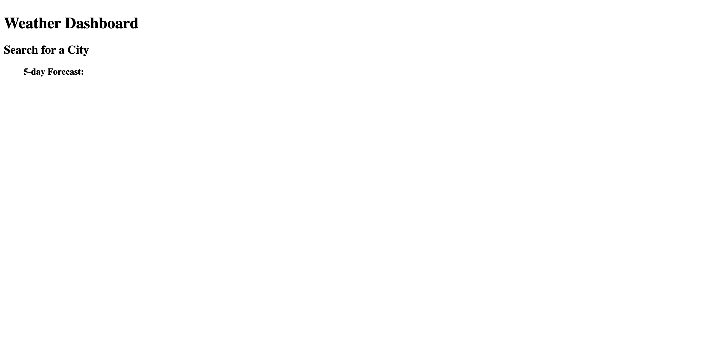

# Name of Application
Your Weather Dashboard

# Contirbutors
Created by Joseph Cooper

# Brief Description of Application
Allows user to get a 5 day forcast of local weather or search other cities.

# Technology Used
HTML
CSS
JS

# Description
Weather app that will pull local data or data from selected city so user can view a 5 day frocast.

# Setup Requirements

click on the link   https://josephjamescoop.github.io/your-weather-dashboard/

alternatively you can follow these steps/

go to https://github.com/JosephJamesCoop/your-weather-dashboard and clone the repository
open file titled password-generator-challenge
open index.html in default browser

# Known Bugs
Application is still being developed. Loads only minor text from HTMl.

# Preview of Appliaction Loaded Properly

